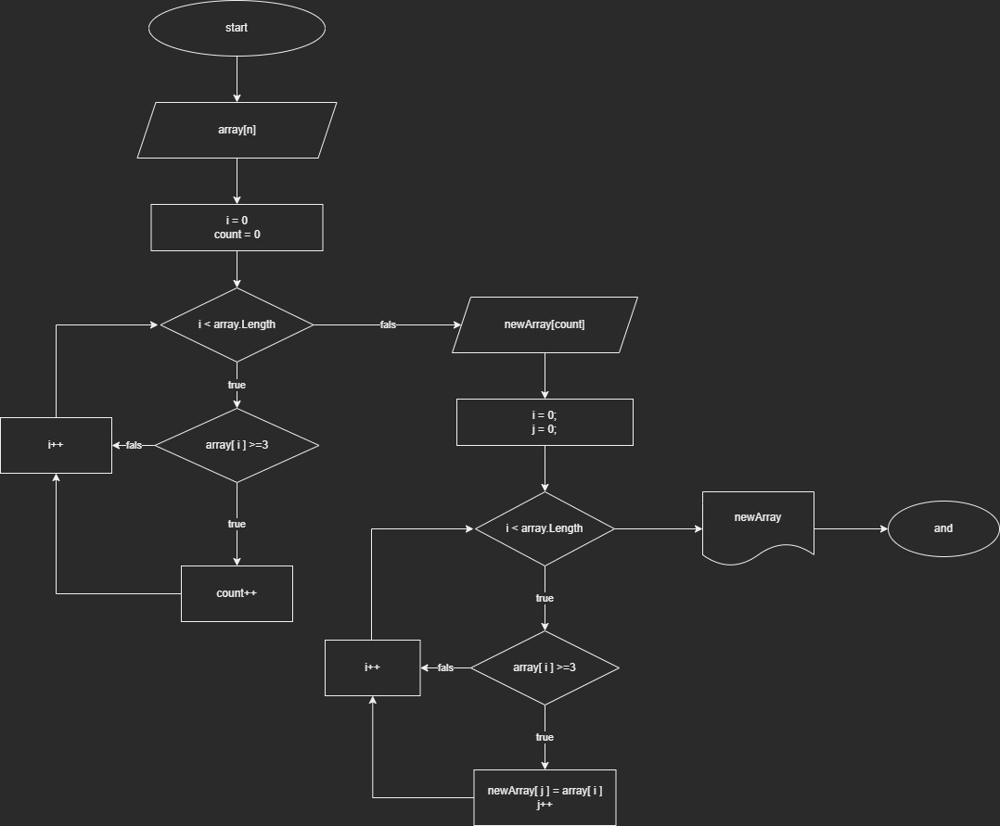

# Программа для сортировки массива строк.

## Блок схема основного метода сортировки


---

## Описание решения:

* С помощью метода **CreatrArrayString()** задаем размер и наполнение массива. Пользователь вводит все данные с клавиатуры. 

* Основной метод сортировки **Sorting** находит количество элементов массива которые больше или равны 3 символам. Задается новый массив размером равный количеству найденных элементов. Новый массив запоняется элементами которые больше или равны 3 символам. 

* Метод **PrintArray** используется для вывода массива в терминал.

*  Далее создаем новый массив с помощью метода сортировки и выводим плученный результат в терминал.
```
PrintArray(array);
Console.Write(" -> ");

string[] newArray = Sorting(array);
PrintArray(newArray);
```